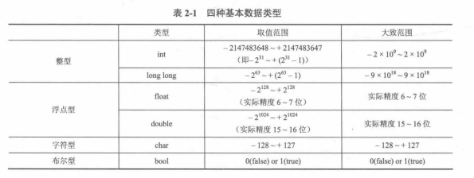
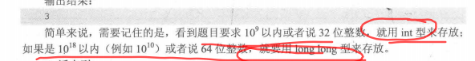
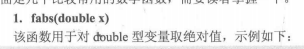
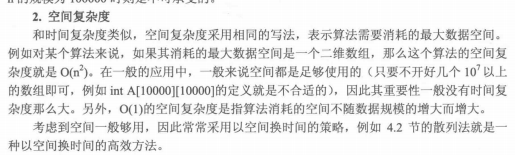
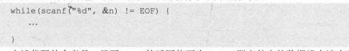
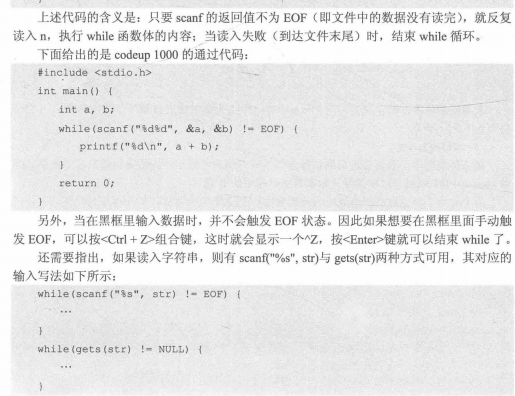
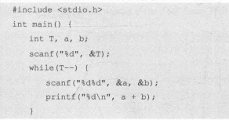
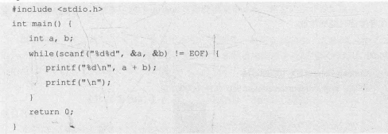
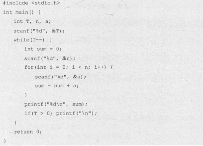

# 不要在一个程序中同时使用cout与printf有可能会出错

# define 和const 的区别
define是宏定义 而 const 是常变量 宏定义是直接对相应的部分替换 然后才进行编译和运行。
```cpp
#include<iostream>
#define CAL(x) (x*2+1)

int main()
{
    int a=1;
    printf("%d\n",CAL(a+1));
    return 0;
}
```
答案为4 括号优先级问题

# 变量的范围



整形4个字节 longlong  8个字节



题目中有10^9或32为整数使用int 即可 题目中说 10^18或64为整数用 long long 来存储

单精度的浮点数的有效精度 只有6-7位

双精度 有15-16位

字符型 -128-+127

**注意：小写字母的ASCII 码比大写字母大32位**

C语言程序 字符串

```cpp
#include<cstdio>
int main()
{
    char str1[25]="Wo ai de ren ye ai wo";
    char str2[25]="So good a story it is.";
    printf("%s,%s",str1,str2);
    return 0;
}
```

不能把字符串常量赋值给字符

const是定义变量 直接使用 而define是直接进行替换

输出格式：

%md 输出m位 进行右对齐 

%0md-------------------------- 左边补充0

%.mf 输出m位小数 四舍六入五成双

# math函数

## 绝对值 fabs



## 取整 floor(double x) 向下 ceil (double x) 向上

## pow（double r,double p） r^p

## sqrt(double x) 算数平方根

## log(double x) 自然数为底的对数

## sin(double x) cos(double x) tan(double x)

## asin(double x) acos(double x) atan(double x)

## round(double x) 四舍五入 返回double 需要取整

```cpp
#include<iostream>
using namespace std;
int main()
{
    int a[5]={3,1,4,2,5};
    for(int i=1;i<=4;i++)
    {
        for(int j=0;j<5-i;j++)
        // 冒泡排序
       if(a[j]>a[j+1])
       {
           int temp=a[j];
           a[j]=a[j+1];
           a[j+1]=temp;
       }
    }
for(int i=0;i<5;i++)
{
    cout<<a[i];
}
    return 0;
}
```

冒泡排序比较简单，每次每趟都是把最大的数送到最后

# 其他的情况

## memset 对数组中每一个元素赋相同值

格式memset(数组名，值，sizeof(数组名))

开头添加string.h头文件 按字节赋值

新手只建议赋值0 -1

gets() --- \n 为结束标志 puts() 输出一行加换行符

# Stirng.h库 

## strlen(字符数组) 求长度

## strcmp(字符数组1，字符数组2) 字典序比较

前者小 返回符数 相等 返回0 前者大 返回正数

## strcpy(字符数组1，字符数组2) 把2赋值给1

## strcat(字符数组1，字符数组2) 把2接到1后

## sscanf() sprintf() 

https://www.tutorialspoint.com/c_standard_library/c_function_sscanf.htm

# 复杂度

## 时间

## 空间



# 黑盒测试

## 单点测试

每组数据分别测试 一组过了得到一组的分值

## 多点测试

所有数据一起测试，

### while EOF型





### while(T--)

给定数据的大小

demo



### 正常输出

### 每组数据输出后加一个空行



### 两组数据之间有一个空行 最后一组数据后没有空行



### 两个整数之间需要空格 而最后一个不需要

```cpp
for(int i=0;i<N；i++)
{
    pritnf("%d",a[i]);
    if(i<N-1)
    {
        printf(" ");
    }
    else
    {
        printf("\n")
    }
}
```

